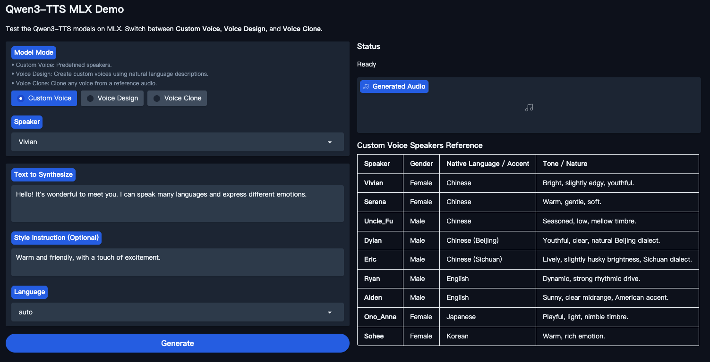

# Qwen3-TTS MLX UI

A local Text-to-Speech (TTS) UI utilizing **Qwen3-TTS** models running on Apple Silicon via the **MLX** framework.

This project provides an interactive web interface (Gradio) for experimenting with high-fidelity speech synthesis.



## Features

*   **Apple Silicon Optimized:** Leveraging `mlx` for efficient inference on M-series chips (M1/M2/M3/M4).
*   **3 Modes:**
    *   **Custom Voice:** Select from 9 high-quality, predefined speakers (English, Chinese, Japanese, Korean).
    *   **Voice Design:** Create custom voices using natural language descriptions.
    *   **Voice Clone:** Clone any voice from a reference audio.
*   **Interactive Interface:** web interface built with Gradio.
*   **Multilingual:** Supports generation in English, Chinese, Japanese, Korean, German, French, Spanish, Italian, Portuguese, and Russian.

## Prerequisites

*   **Hardware:** Apple Silicon Mac (M1 or newer).
*   **OS:** macOS.
*   **Python:** Python 3.12+ is recommended.
*   **Hugging Face CLI:** Required to download models.

## Installation

1.  **Clone the repository:**

2.  **Create and activate a virtual environment:**
    ```bash
    python3 -m venv venv
    source venv/bin/activate
    ```

3.  **Install dependencies:**
    ```bash
    pip install -r requirements.txt
    ```

## Model Setup

Before running the app, you need to download the quantized models using the Hugging Face CLI.

1.  **Install Hugging Face CLI** (if not already installed via requirements):
    ```bash
    pip install huggingface_hub
    ```

2.  **Download the Models:**
    Run the following commands to download the 8-bit quantized versions of both model variants:

    ```bash
    # Download Custom Voice Model (Predefined Speakers)
    hf download mlx-community/Qwen3-TTS-12Hz-1.7B-CustomVoice-8bit

    # Download Voice Design Model
    hf download mlx-community/Qwen3-TTS-12Hz-1.7B-VoiceDesign-8bit
    
    # Download Voice Clone Model (Base)
    hf download mlx-community/Qwen3-TTS-12Hz-1.7B-Base-8bit
    ```

    *Note: If you wish to use different model variants (e.g. 0.6B, 4-bit or full precision), download them similarly and update the `MODEL_PATH_CV`, `MODEL_PATH_VD`, and `MODEL_PATH_BASE` variables in `app.py`.*

## Usage

Launch the web interface to explore all features interactively.

```bash
python app.py
```

*   Open the local URL (typically `http://127.0.0.1:7860`).
*   Switch between **Custom Voice**, **Voice Design**, and **Voice Clone**.
*   View speaker details, input text, and generate audio.


## Acknowledgements

This project builds upon the work of the Qwen Team and the MLX Audio library.

*   **[Qwen3-TTS](https://github.com/QwenLM/Qwen3-TTS)**
*   **[MLX Audio](https://github.com/Blaizzy/mlx-audio):**


```bibtex
@article{Qwen3-TTS,
  title={Qwen3-TTS Technical Report},
  author={Hangrui Hu and Xinfa Zhu and Ting He and Dake Guo and Bin Zhang and Xiong Wang and Zhifang Guo and Ziyue Jiang and Hongkun Hao and Zishan Guo and Xinyu Zhang and Pei Zhang and Baosong Yang and Jin Xu and Jingren Zhou and Junyang Lin},
  journal={arXiv preprint arXiv:2601.15621},
  year={2026}
}
```

```bibtex
@misc{mlx-audio,
  author = {Canuma, Prince},
  title = {MLX Audio},
  year = {2025},
  howpublished = {\url{https://github.com/Blaizzy/mlx-audio}},
  note = {Audio processing library for Apple Silicon with TTS, STT, and STS capabilities.}
}
```